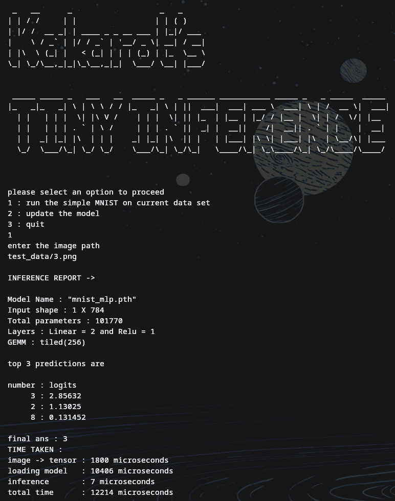

# tiny-inference

A from-scratch C++ inference engine — no libtorch, no ML framework of any kind.

The project was built to understand model serialization, runtime construction, memory behavior, and performance engineering rather than to compete with production ML runtimes.

Parses a real PyTorch `.pth` file at the binary level (ZIP container → pickle opcodes → raw float32 tensors), builds an MLP entirely from primitives, and runs inference on user provided image  in **~12 microseconds** and the forward pass itself executing in **~8 microseconds** Ryzen 5 5500U.

The network depth is not hardcoded — the engine reads weight/bias pairs from model metadata and constructs a `Linear → ReLU → ... → Linear` sequence dynamically, suppressing ReLU after the final output layer.

Built to understand what actually happens inside the stack, not to use it.

---

## What it does

```
Input image (PNG/JPG)
      ↓
  stb_image decode
      ↓
  Grayscale + resize → N-element float32 Tensor
  (resize target read from model metadata)
      ↓
  Linear(in → hidden) + ReLU
      ↓
  Linear(hidden → out)
      ↓
  Top-3 logits + argmax prediction
```

The model weights come from a pretrained `mnist_mlp.pth` checkpoint. The engine reads that file entirely by itself — ZIP parsing, pickle opcode dispatch, and float32 tensor extraction — without depending on Python or libtorch at any point.

The layer dimensions and image resize target are read from the extracted model metadata at runtime. Any model architecture (different hidden sizes, different input dimensions) works as long as the `.pth` file parses correctly and the weights are consistent — the engine makes no hardcoded assumptions about shape.

---

## Inference Output (Real Run)

Showcasing running the engine:


Screenshot of inference + benchmark:



```text
INFERENCE REPORT

Model Name   : "mnist_mlp.pth"
Input shape  : 1 x 784
Total params : 101770
Layers       : Linear = 2, ReLU = 1
GEMM         : tiled(256)

top 3 predictions:
  3 : 2.85632
  2 : 1.13025
  8 : 0.131452

final ans : 3

TIME TAKEN :
  image -> tensor : 1502 microseconds
  loading model   : 10100 microseconds
  inference       : 8 microseconds
  total time      : 11611 microseconds
```

## Model Loading Demo

Showcasing updating the model:


---

## Architecture

### `.pth` parser — `src/pth_converter.{h,cpp}`

A PyTorch `.pth` file is a ZIP archive containing a `data.pkl` pickle stream and raw binary tensor storage files. No library touches this file — the parser handles it in four phases:

1. **EOCD parsing** — seek to offset `-22` from EOF, validate the `0x06054B50` signature, read the central directory offset
2. **Central directory walk** — extract each `zfiles` entry: filename, uncompressed size, local header offset, computed data offset
3. **Pickle opcode dispatch** — walk the `data.pkl` byte stream opcode-by-opcode: `BINUNICODE`, `BININT1/2`, `TUPLE2/3`, `REDUCE`, `BUILD`, `SETITEMS`, `BINPERSID`, `STOP` and others, building a `WData` list of tensor names, shapes, dtypes, and storage IDs
4. **Tensor extraction** — seek to the raw storage file for each tensor, read `numel × sizeof(float32)` bytes directly into the `Tensor` heap

Two days were spent on this. The pickle layer is the hard part — `BINPERSID` links the logical tensor descriptor in the pickle stream to the physical storage file in the ZIP, and getting that linkage right required reading the CPython pickle source alongside hex dumps of the actual file.

---

### Tensor — `src/tensor.{h,cpp}`

A minimal 2D float32 tensor with move-only semantics (copy constructor and copy assignment explicitly deleted). Internal storage is `std::vector<float>` with row-major layout. Raw pointer access via `data()` is exposed for GEMM kernels that need to bypass the API.

---

### GEMM — `src/GEMM.{h,cpp}`

What started as three straightforward kernel variants grew into a full hand-written optimization progression once the naive versions plateaued against the compiler's auto-vectorizer:

| Variant | Description |
|---|---|
| `Gemm_ijk` | ijk loop order with a local `sum` accumulator — eliminates per-iteration read-modify-write on `C` |
| `Gemm_ikj` | ikj loop order with raw pointer access — hoists `A[i,k]` out of the inner loop, cache-friendly sequential access on `B` and `C` |
| `Gemm_tiled` | Cache-blocked tiling with configurable `block_size` — same ikj inner order, keeps tiles in L1/L2 across the outer loops |
| `Gemm_simd` | Hand-written AVX2 intrinsics (`_mm256_fmadd_ps`), flat `ikj` order, no tiling |
| `Gemm_tiled_simd` | Cache-blocked tiling + hand-written AVX2, evolved through several register-blocking strategies (single accumulator → k-unrolled multiple accumulators → 2D row/column blocking → combined 2-row × 4-wide-k-unroll microkernel with 8 live accumulators) |

The inference binary currently uses `Gemm_tiled(256)` — see the benchmarking section below for why the fully hand-tuned `Gemm_tiled_simd` variant (currently the fastest kernel measured) hasn't been swapped in yet.

---

### Layers — `src/Layer.h`, `linear`, `relu`, `sequence`

`Layer` is a pure abstract base with a single `forward(Tensor&) → Tensor` virtual method. `Linear` owns weight and bias tensors loaded from the extracted dataset files. `sequence` holds a `std::vector<Layer*>` and chains `forward` calls. `~sequence` walks the pointer list and deletes each layer.

---

### Image pipeline — `src/image_to_tensor.{h,cpp}`

Uses `stb_image` (single-header, `third_party/stb_image.h`) to decode PNG and JPG. Converts to grayscale, resizes to the target resolution read from model metadata, normalizes to `[0, 1]`, and produces a flat float32 Tensor with the correct input size for the first Linear layer. The resize target is not hardcoded — it is derived from the model's input dimension at runtime, so different models with different input sizes work without code changes.

---

## GEMM optimization journey

The most methodical part of this project. Every change was benchmarked before and after, measured in nanoseconds, correctness verified by checksum.

**Hardware:** Ryzen 5 5500U — 6 cores / 12 threads, AVX2 + FMA available  
**Compiler:** GCC, C++20, Release mode (`-O3 -march=native`)

### Summary — 1000 × 1000 matrix multiply

| Version | What changed | Time | vs V0 |
|---|---|---|---|
| V0 — baseline | Naive ijk, Tensor API calls everywhere | 23.19 s | — |
| V0.5 — hoist | Hoist `a.get_val(i,k)` out of inner loop | 17.89 s | ~1.3× faster |
| V1 — reorder + accumulator | Switch to ikj order, local `sum` var | 12.72 s | ~1.8× faster |
| V2a — raw pointers (debug) | Bypass Tensor API, direct pointer arithmetic | 2.59 s | ~8.9× faster |
| V2b ikj — raw pointers (release) | Add `-O3`, compiler auto-vectorizes to SSE→AVX2+FMA | **0.19 s** | **~122× faster** |
| V3 — tiled(256) | Cache blocking over all three loop dimensions | 0.61 s | ~38× faster |
| V4 — hand-written AVX2 (`Gemm_simd`) | Manual `_mm256_fmadd_ps`, flat order, no tiling | ~0.19 s (parity with V2b) | ~122× faster |
| V5 — k-unrolled accumulators | 4-wide k-unroll, multiple `__m256` accumulators (fixes FMA latency-chain stalls) | ~49 ms | ~2× faster than V4's tiled-SIMD baseline |
| V6 — 2D register blocking | 2 output rows × 8 columns per tile, halves `B` memory traffic | ~34 ms | further ~1.4× over V5 |
| V7 — combined (2 rows × 4-wide k-unroll, 8 accumulators) | Merges V5 and V6's strategies into one microkernel | **~34 ms best case, up to ~60 GFLOPS**, `block(64)` best across all sizes | **~2–4× faster than flat auto-vectorized `ikj`, consistently** |

Note: tiled(256) alone (V3) is slower than flat ikj at 1000×1000 — tile management overhead outweighs cache benefit at that working set size. The crossover happens at 2000×2000, where tiled(256) beats ikj by **~1.4×** as the matrix no longer fits comfortably in cache. Once hand-written AVX2 and register blocking (V4–V7) entered the picture, this flipped: `Gemm_tiled_simd` at `block(64)` beats flat `ikj` consistently across **every** tested size (200×200 through 2000×2000), not just the largest one.

→ **[Full benchmarking log with all variants and sizes](benchmarking/README.md)**

### SIMD investigation

Under plain `-O3`, GCC auto-vectorizes all three original kernels using SSE (128-bit XMM, 4 floats/instruction). Adding `-march=native` upgrades to AVX2 (256-bit YMM, 8 floats) + FMA (`vfmadd213ps` — multiply-add in one instruction).

At first, hand-writing the same AVX2 intrinsics the compiler was already emitting (`Gemm_simd`, V4) barely moved the runtime. This was the most important early lesson of the project: **arithmetic throughput was not the bottleneck at that stage** — the kernel was memory/cache bound, so doubling SIMD width had marginal impact because the bottleneck was getting data into registers, not processing it once it was there.

That framing held only up to a point. Once register blocking was introduced — multiple accumulators to hide FMA latency (V5), then blocking across output rows to reuse loaded `B` values across multiple FMAs instead of reloading (V6), then combining both (V7) — the memory-bound ceiling actually moved. Reducing *how often* memory had to be touched per unit of useful work (not just how fast each touch happened) is what got the fully-tuned `Gemm_tiled_simd` kernel to **~2–4× over flat `ikj`**, consistently, rather than the "marginal impact" seen in the first SIMD pass. The bottleneck was real, but it wasn't fixed — it was moved, by giving the CPU more independent work to overlap per byte of data loaded.

→ **[SIMD investigation notes](asm_docs/README.md)**

---

## Build

Requires: `cmake ≥ 3.20`, `g++ with C++20 support`

```bash
git clone https://github.com/Udbhav-Dubey/tiny-inference.git
cd tiny-inference
cmake -B build -DCMAKE_BUILD_TYPE=Release -DCMAKE_CXX_FLAGS="-march=native"
cmake --build build
./build/tiny-inference
```

> **Note:** `-march=native` enables AVX2 + FMA on supported hardware and is already set on the `tensor` library target in `CMakeLists.txt`. The test targets build with `-UNDEBUG` to force asserts on even in Release — the main binary does not currently have this flag.

To run a specific test:

```bash
./build/test_gemm
./build/test_linear_1
./build/test_sequence
# etc.
```

---

## Repository layout

```
tiny-inference/
├── src/
│   ├── tensor.{h,cpp}          # 2D float32 tensor, move-only
│   ├── GEMM.{h,cpp}            # GEMM kernel variants (naive → tiled → hand-written AVX2 → register-blocked)
│   ├── linear.{h,cpp}          # Linear layer (weight + bias)
│   ├── relu.{h,cpp}            # ReLU activation
│   ├── sequence.{h,cpp}        # layer chain
│   ├── pth_converter.{h,cpp}   # .pth parser: ZIP + pickle + tensor extraction
│   ├── image_to_tensor.{h,cpp} # stb_image decode → 784-float Tensor
│   ├── prediction.{h,cpp}      # argmax + top-3
│   └── main.cpp
├── benchmarking/
│   ├── README.md               # full GEMM optimization log
│   └── gemm_benchmark_*.cpp
├── asm_docs/
│   ├── README.md               # SIMD investigations 1 & 2
│   └── GEMM*.s / *.txt         # generated assembly dumps
├── test/                       # component tests for each module
├── test_data/                  # sample images + mnist_mlp.pth checkpoint
├── data_set/                   # extracted weight/bias .txt files
├── third_party/
│   └── stb_image.h             # single-header image decode
└── CMakeLists.txt
```

---

## What this is not

This is not a production inference engine. It has no batching, no threading, no quantization, no GPU path. The GEMM is competitive for its level of complexity but not BLAS-level — the fully hand-tuned `Gemm_tiled_simd` microkernel gets a well-tuned single-threaded core into the ~50-60 GFLOPS range, but production libraries (OpenBLAS, BLIS, MKL) go further with operand packing, multi-level cache-block tuning, and multithreading, none of which are implemented here yet. The `.pth` parser handles the specific opcodes emitted by the PyTorch version used to save this checkpoint — it is not a general pickle interpreter.

It is a study in how the pieces fit together at the level where you can actually see them.

---

## What's next

- **Multithreaded GEMM** — thread pool integration (currently in progress as a separate concurrency project)
- **Operand packing + multi-level cache blocking** — decouple the k-panel size from the row/column tile size (currently one shared `block_size` does both jobs) and pack `A`/`B` into contiguous panels before the microkernel runs; attempted once already and reverted — the packing loop broke `C`'s temporal locality and the packed buffer didn't fit cache at larger block sizes, so this needs the full 5-loop restructuring, not a patch on the current 3-loop tiling
- **Arena allocator** — port the custom arena from a parallel memory allocators project to replace heap allocation in the hot path; expected to reduce inference latency further
- **ONNX support** — extend the model loader to handle `.onnx` format, enabling any ONNX-exported model to run through this engine without conversion
- **Broader `.pth` opcode coverage** — the current pickle parser handles the opcodes emitted by the checkpoint used here; generalizing it to handle arbitrary PyTorch exports is the next parser milestone
